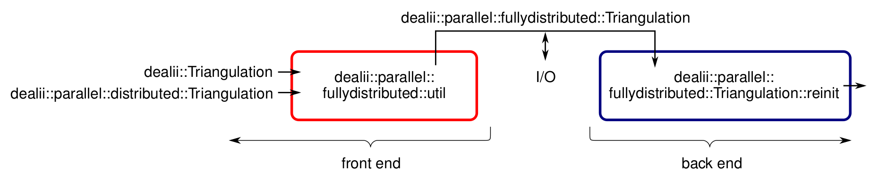
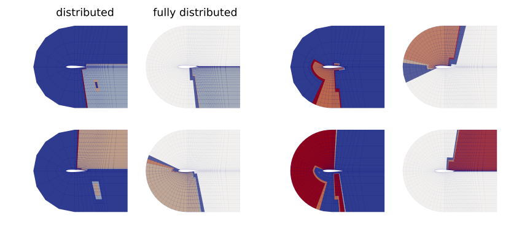
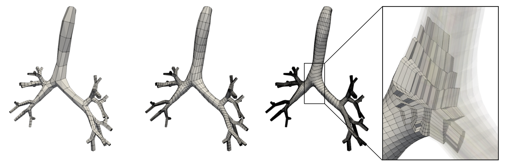
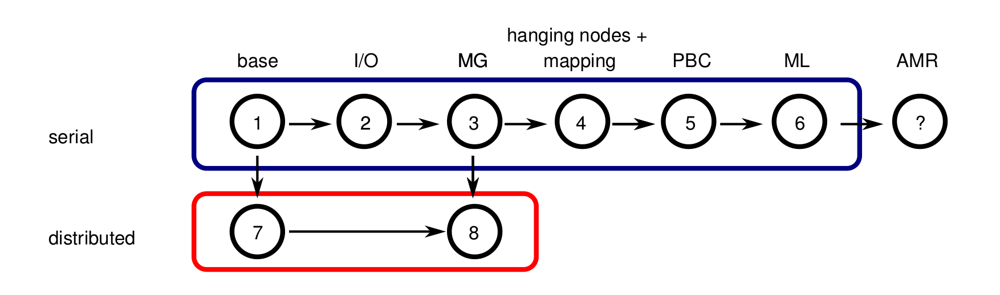
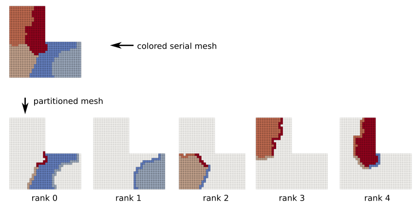
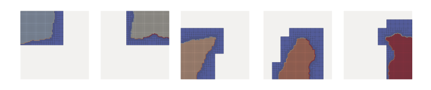
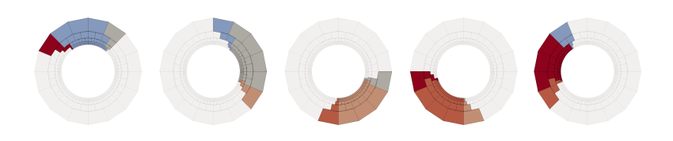
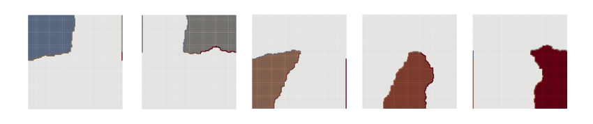

# A new, fully distributed triangulation in deal.II

This repo contains programs that clarify the usage of the new framework `parallel::fullydistributed::Triangulation` (short: `PFT`)
in deal.II. For implementation details see the attached presentation (WIP) and/or the source code here and on 
[my fork of deal.II](https://github.com/peterrum/dealii/tree/parallel-fullydistributed-triangulation).

**Note:** The reason for the choice of the name `parallel::fullydistributed::Triangulation` is the need to 
distinguish this class from `parallel::distributed::Triangulation` and to emphasize that also
the coarse mesh is partitioned in this case. Please feel free to suggest alternative names!  

## Requirements

An (incomplete) list of requirements - beside the need to partition the coarse grid - is:
- [x] extract from `dealii::Triangulation` (serial triangulation) 
- [x] extract from `dealii::parallel::distributed::Triangulation` (parallel triangulation) 
- [x] static mesh
- [x] hanging nodes
- [x] geometric multigrid
- [x] periodicity
- [x] 2D/3D and 1D (also in parallel!)
- [x] I/O from/to `*.pft`-files
- [ ] adaptive mesh refinement (AMR)

The ticks indicate that the given features have been implemented to the best of the author's knowledge. The
features were tested for a small set of triangulations (hypercube, subdivided hypercube, hyper-L, and
hyper-shell with a large number of different of refinement, subdivision and process counts). 

## Concept

The motivation to implement the new `PFT` framework has its origins in the following observations about 
complex triangulations and/or about given meshes created by an external mesh generator. I 
regard complex geometries as geometries that can be meshed only with a non-negligible 
number of coarse cells (>10,000):

- storing the coarse-grid information on every process is too expensive from a memory point of view
  (especially, if you consider that a single compute node on SuperMUC-NG has 48 CPUs, which means
   the coarse grid is duplicated 48 times on the same node in the case that a pure MPI program
   is considered). Normally, a process only needs a small section of the global triangulation,
   i.e., a small section of the coarse grid, such that a **partitioning of the coarse grid** is
   indeed essential.

- the distribution of the active cells - on the finest level - among all processes by simply 
  partitioning a space-filling curve might not lead to an optimal result for triangulations
  that originate from large coarse grids: e.g. partitions that belong
  to the same process might be discontinuous, leading to increased communication amount (within a
  node and beyond). **Graph-based partitioning** algorithms might a sound alternative.

**Note:** The first aspect could be tackled via applying hybrid programming (MPI+X), i.e., all threads of
a processor access the same triangulation object. My implementation does not investigate this 
aspect, but rather investigates partitioning algorithms that explicitly exploit
hardware properties regarding the NUMA-domain, the node and the island sizes.

To be able to construct a fully partitioned triangulation that fulfills the [requirements](https://github.com/peterrum/dealii-pft#requirements), we need
following ingredients:
1. a locally relevant coarse-grid triangulation (vertices, cells with material and manifold IDs, boundary IDs;
   including a layer of ghost cells)
2. a mapping of the locally relevant coarse-grid triangulation into the global coarse-grid triangulation
3. information about which cell should be refined as well as information regarding the subdomain ID and the level 
   subdomain ID of each cell.

The ingredients listed above are bundled in `parallel::fullydistributed::ConstructionData`. The user has 
to fill this data structure - in a pre-processing step - before actually creating the triangulation.
As you will see, I provide a front-end to serialize and deserialize triangulations as well as to convert
serial and distributed meshes.



## Additional information

- A triangulation does not come alone. It is accompanied by a `DoFHanlderPolicy`. The new 
policy works similarly as the policy of `dealii::parallel::distributed::Triangulation` except
that the local enumeration of the coarse cells needs to be translated to a global enumeration before
sending data, and vice versa, if the received data should be processed.

- The new triangulation inherits from `parallel::Triangulation`. Small modifications were needed
to enable parallel 1D simulations and periodicity, which used to be imposed on the coarse-grid.

- To be able to use the code, following steps have to be performed:
```bash
# get the feature branch of deal.II build it with MPI, Metis, p4est:
git clone https://github.com/peterrum/dealii.git
cd dealii
git checkout parallel-fullydistributed-triangulation
cd ..
mkdir dealii-build
cd dealii-build
cmake -D DEAL_II_WITH_MPI="ON" -D DEAL_II_WITH_METIS:BOOL="ON" -D DEAL_II_WITH_P4EST="ON" ../dealii
make -j30
cd ..

# clone this repo and build it
git clone https://github.com/peterrum/dealii-pft.git
mkdir dealii-pft-build
cd dealii-pft-build
cmake ../dealii-pft-build
```

## Examples (and nice colorful pictures)

The following pictures show use cases for which the new `PFT` framework has been applied.

### NACA 0012 airfoil

NACA 0012 airfoil with 156 coarse-grid cells and 2 refinement levels. The fully 
distributed triangulation was created as described in [step-6](https://github.com/peterrum/dealii-pft#step-6-multi-level-partitioning-of-a-serial-mesh).



The large amount of artificial cells (dark blue) and the suboptimal partitioning of the fine
grid is well visible in the case of `parallel::distributed::Triangulation`.

Thanks to [Elias Dejene](https://github.com/eliasstudiert)!

### Lung

Deformed mesh of a lung with six generations and 1,968 coarse-grid cells with 
different refinement levels:



Simulations with many more lung generations (>8 lung generations with at least 9396 coarse cells in total) 
are needed to be able to retrieve biologically meaningful results.

Thanks to [Martin Kronbichler](https://github.com/kronbichler)!

## Tutorials

In the following, I provide eight short tutorials (referred to as *step*s) using `PFT`.
These tutorials are - in contrast to the 
examples described above - quite academic and are ordered according to their difficulty.



The structure of each tutorial is as follows:
1. create a serial or a distributed triangulation,
2. extract the locally relevant triangulation information via a front-end
3. create the fully distributed triangulation with the help of this information.
4. setup the `DoFHanlder` as a validation step (optionally also the multigrid levels are filled).


The flexibility of having a front-end and a back-end should become obvious in the following examples.

**Note:** The tutorials are tested applications. Please feel free to 
suggest additional use cases and/or to extend the relevant classes.


### Step 1: Static, globally uniformly refined serial mesh

**Short description:** Convert a colored (partitioned) serial fine mesh of a type`dealii::Triangulation`.

We create a serial triangulation `dealii::Triangulation`. We partition the active cells
by simply applying `dealii::GridTools::partition_triangulation()`. 

The locally relevant mesh information is extracted by calling the new function:
```cpp
template<int dim, int spacedim = dim>
ConstructionData<dim, spacedim>
copy_from_triangulation(const dealii::Triangulation<dim, spacedim> & tria,
                        const Triangulation<dim, spacedim> &         tria_pft)
```
and used to setup `PFT`:
```
template<int dim, int spacedim = dim>
reinit(ConstructionData<dim, spacedim> data);
```

**Execution:**

```bash
cd step-1
make
mpirun -np 5 ./step-1 2 4 # dim, n_refinements
```

**Results:**



**Note:** This use case is motivated by the tests of `parallel::split::Triangulation`, which 
have been discussed
in [PR #3956](https://github.com/dealii/dealii/pull/3956).


### Step 2: I/O: serialization and deserialization

**Short description:** This step presents the serialization and deserialization capabilities of `PFT`.

As in [step-1](https://github.com/peterrum/dealii-pft#step-1-static-globally-uniformly-refined-serial-mesh),
a serial mesh is converted. 
However, in between the construction data is written to files with the help of the library
`boost`:
```cpp
parallel::fullydistributed::Utilities::serialize(construction_data, file_name, comm);
```
 and read right away from them:
```cpp
auto construction_data = parallel::fullydistributed::Utilities::deserialize<dim>(file_name, comm);
```

**Execution:**

```bash
cd step-2
make
mpirun -np 5 ./step-2 2 4 # dim, n_refinements
```


### Step 3: Static, globally uniformly refined serial mesh with multigrid levels

**Short description:** Convert a serial mesh with all multigrid levels.

**Execution:**

```bash
cd step-3 
make
mpirun -np 5 ./step-3 2 4 8
```

**Results:**




### Step 4: Static, globally non-uniformly refined serial mesh 

**Short description:** Convert a serial triangulation with hanging nodes 
(see also [step-1 in deal.II](https://www.dealii.org/developer/doxygen/deal.II/step_1.html)).

**Note:** To be able to handle hanging nodes, it is currently required to construct all 
multigrid levels.

**Execution:**

```bash
cd step-4
make
mpirun -np 5 ./step-4 2 4 8
```


**Results:**




### Step 5: Partition a serial mesh with periodic faces

**Short description:** The tutorial is the same as 
[step-3](https://github.com/peterrum/dealii-pft#step-3-static-globally-uniformly-refined-serial-mesh-with-multigrid-levels), but with periodic faces in x-direction.


**Execution:**

```bash
cd step-5 
make
mpirun -np 5 ./step-5 2 4 8
```

**Results:**




### Step 6: Multi-level partitioning of a serial mesh 

**Short description:** Create a serial triangulation on selected master processes, partition the mesh 
using METIS, taking node-locality into account, and finally distribute the mesh information.

**Note:** For distribution, the construction data is serialized to a buffer (see [step-2](https://github.com/peterrum/dealii-pft#step-2-deserialization)), 
which is sent via `MPI`.


**Execution:**

```bash
cd step-6
make
mpirun -np 5 ./step-6 2 4 8
```


### Step 7: Static, globally uniformly refined mesh (distributed)

**Short description:** Convert the fine mesh of a `parallel::distributed::Triangulation` (`PDT`).


**Execution:**

```bash
cd step-7
make
mpirun -np 5 ./step-7 2 8
```


### Step 8: Static, globally uniformly refined mesh with multigrid levels (distributed)

**Short description:** Convert a `PDT` with all multigrid levels.


**Execution:**

```bash
cd step-8
make
mpirun -np 8 ./step-8 4 3 5
```

**Results:**


